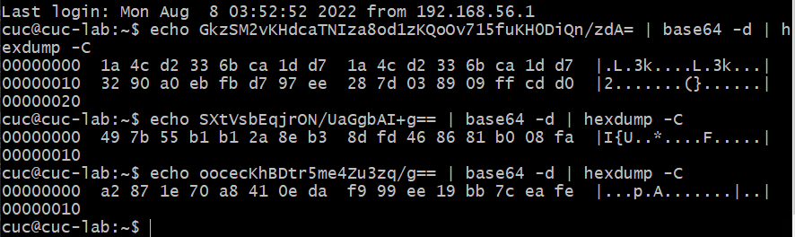
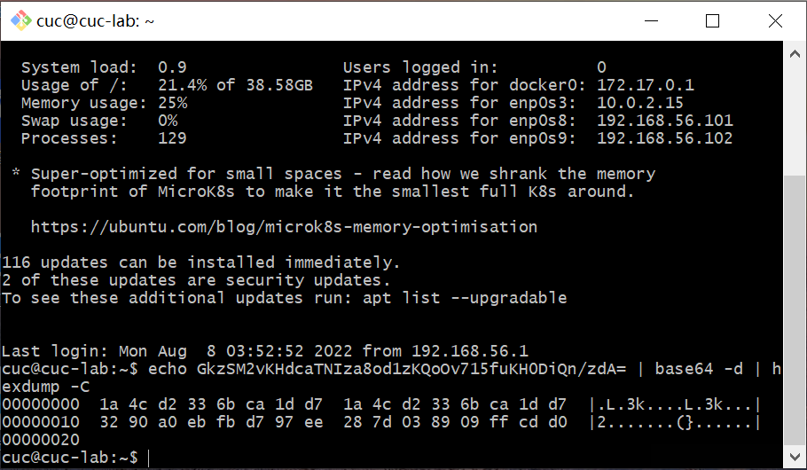

# Electronic Code Book (ECB)

## 实验环境

`Ubuntu 20.04`

`Vscode remote`

## 实验原理

### ECB：主要用于发送很少明文分组时。例如，用主密钥加密会话密钥

将消息分组，使用密钥对各组进行加密。

#### 优点

1. 可以并行运算
2. 适用于随机存储的数据，比如加密密钥
3. 有良好的差错控制

#### 缺点

1. 当明文分组重复时，密文也重复，易实现统计分析攻击
2. 结构化数据，将产生大量重复的密文
3. 统计分析、分组重放、代换攻击

### 分组重放

1. `ECB` 模式最严重的问题是允许选取部分分组进行重放攻击
2. 特别是针对按分组格式化的数据
3. 必须辅助以消息认证来保证完整性

## 实验过程

### 搭建环境

### 实验

1. 创建2个名称相似的用户：测试1和测试2以及相同的密码，然后查看应用程序发送回的cookie

`cookie`后8个字节相同

密码：123456

`SXtVsbEqjrON/UaGgbAI+g==`

`oocecKhBDtr5me4Zu3zq/g==`

2. 创建一个由相同字符组成的真正长名的用户(比如20次a)，然后查看应用程序发送回的cookie

`GkzSM2vKHdcaTNIza8od1wS28inRHiC2GkzSM2vKHdcaTNIza8od1ys96EXmirn5`

3. 创建一个具有用户名和密码的用户，它将允许您通过删除加密的数据来以管理员身份登录

`GkzSM2vKHdeYMhBvxnBx5BGqti8ykenz`

返回的cookie
`mDIQb8ZwceQRqrYvMpHp8w==`
4. 创建一个用户名的用户，将允许您登录作为管理员交换加密块

`mNFTiQxWSWy1BlFFazd3eshx6uXNvSnx`

返回的cookie
`yHHq5c29KfG1BlFFazd3epjRU4kMVkls`

## 实验结论

1. 说明后台不对密码部分进行验证

2. 8 个字节重复出现且用户名和密码不是直接拼接加密

3. 加密消息的块可以在不干扰解密过程的情况下删除
4. 来自加密消息的块可以四处移动，而不会干扰解密过程。

## 参考文献

1. [搭建环境](http://courses.cuc.edu.cn/course/87823/learning-activity#/368311)

2. [做实验](https://jckling.github.io/2020/05/08/Security/PentesterLab/Electronic%20Code%20Book/)

3. [做实验](https://pentesterlab.com/exercises/ecb/course)

## 实验反思及问题

1. 下载一个包之后可以通过计算校验和验证下载正误

2. 镜像不一定需要安装，.iso格式的是一种光盘镜像文件
3. 新建虚拟机时不用担心虚拟机内存太大
4. 新建虚拟机时推荐双网卡，一个用NAT，一个用host only
5. 宿主机的浏览器也可以打开虚拟机的网页
6. 开发者工具的应用和控制台功能都可以获取`cookie`,控制台也可以修改`cookie`
7. 第三步并不理解为什么几次解码结果不一样
8. 返回cookie不需要用新的用户名和密码登录

修改cookie后刷新网页即可
9. 在命令行窗口里，当输出结果长度超过窗口显示范围时，可使用`命令+“ | less”`(也可能是more)
10. 当遇到不可逆的损伤时，可以重新搭建环境/重装软件
